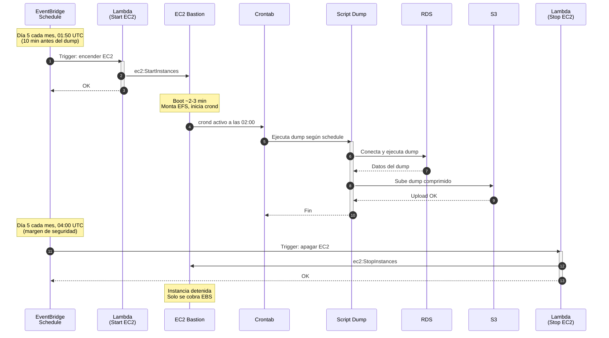

# Comparativa de Costos: EC2 (encendido por demanda) vs Lambda

> Precios referencia: región `us-east-1`, abril 2026.

---

## Escenario

- **Mensual**: 1 ejecución el día 5 de cada mes (~12 veces/año)
- **Anual**: 1 ejecución el día 10 de enero (~1 vez/año)
- **3 motores**: Oracle, PostgreSQL, MySQL (ejecutan secuencialmente)
- **Duración estimada por ejecución**: ~1-2 horas (dump + compresión + upload)
- **La EC2 se enciende solo cuando necesita trabajar y se apaga después**

---

## 1. Costo EC2 (encendido por demanda)

### Instancia: t3.medium (2 vCPU, 4 GB RAM)

| Concepto                      | Cálculo                        | Costo mensual  | Costo anual     |
| ----------------------------- | ------------------------------ | -------------- | --------------- |
| EC2 On-Demand                 | $0.0416/hr × 2 hrs × 1 día/mes | $0.08          | $0.96           |
| EC2 ejecución anual (enero)   | $0.0416/hr × 2 hrs × 1 día/año | —              | $0.08           |
| EBS 50GB gp3 (siempre activo) | $0.08/GB × 50 GB               | $4.00          | $48.00          |
| EFS (almacenamiento temporal) | ~$0.30/GB × ~5 GB promedio     | $1.50          | $18.00          |
| **Subtotal EC2**              |                                | **~$5.58/mes** | **~$67.04/año** |

> **Nota**: El EBS se cobra aunque la instancia esté apagada. El EFS también se cobra por almacenamiento persistente. Estos son los costos dominantes, no el cómputo.

### Costo adicional: automatización del encendido/apagado

Para encender y apagar la EC2 automáticamente necesitas uno de:

| Opción | Costo adicional |
|--------|----------------|
| EventBridge + Lambda (start/stop) | ~$0.00 (free tier cubre esto) |
| AWS Instance Scheduler | ~$0.00 (solución open-source de AWS) |
| Systems Manager Maintenance Window | Incluido con SSM |

---

## 2. Costo Lambda

### Configuración por función

| Motor | Memoria | Timeout | Tipo |
|-------|---------|---------|------|
| PostgreSQL | 1024 MB | 15 min max | ZIP + Layer |
| MySQL | 1024 MB | 15 min max | ZIP + Layer |
| Oracle | 2048 MB | 15 min max | Container image |

### Cálculo mensual (1 ejecución/mes × 3 motores)

| Concepto | Cálculo | Costo mensual | Costo anual |
|----------|---------|---------------|-------------|
| Lambda compute (PG) | 1024 MB × 600s × 1/mes × $0.0000166667/GB-s | $0.01 | $0.12 |
| Lambda compute (MySQL) | 1024 MB × 600s × 1/mes × $0.0000166667/GB-s | $0.01 | $0.12 |
| Lambda compute (Oracle) | 2048 MB × 600s × 1/mes × $0.0000166667/GB-s | $0.02 | $0.24 |
| Lambda requests | 3 invocaciones/mes × $0.20/1M | $0.00 | $0.00 |
| Lambda ephemeral storage | 10 GB × 600s × 3 × $0.0000000309/GB-s | $0.00 | $0.00 |
| EventBridge rules | 6 reglas | $0.00 | $0.00 |
| Secrets Manager | 3 secretos × $0.40/mes | $1.20 | $14.40 |
| ECR (imagen Oracle) | ~1 GB almacenamiento | $0.10 | $1.20 |
| **NAT Gateway** (si no existe) | $0.045/hr × 730 hrs + data | **$32.85/mes** | **$394.20/año** |
| **VPC Endpoints** (alternativa a NAT) | 2 endpoints × $0.01/hr × 730 hrs | **$14.60/mes** | **$175.20/año** |
| **Subtotal Lambda (con NAT existente)** | | **~$1.34/mes** | **~$16.08/año** |
| **Subtotal Lambda (NAT nuevo)** | | **~$34.19/mes** | **~$410.28/año** |
| **Subtotal Lambda (VPC Endpoints)** | | **~$15.94/mes** | **~$191.28/año** |

---

## 3. Comparativa directa

### Escenario A: Ya tienes NAT Gateway en la VPC

| | EC2 por demanda | Lambda |
|---|---|---|
| Costo mensual | ~$5.58 | ~$1.34 |
| Costo anual | ~$67.04 | ~$16.08 |
| **Ahorro Lambda** | | **~76% menos** |

### Escenario B: NO tienes NAT Gateway (hay que crearlo)

| | EC2 por demanda | Lambda + NAT nuevo |
|---|---|---|
| Costo mensual | ~$5.58 | ~$34.19 |
| Costo anual | ~$67.04 | ~$410.28 |
| **Resultado** | **EC2 gana** | 6x más caro |

### Escenario C: NO tienes NAT, usas VPC Endpoints en su lugar

| | EC2 por demanda | Lambda + VPC Endpoints |
|---|---|---|
| Costo mensual | ~$5.58 | ~$15.94 |
| Costo anual | ~$67.04 | ~$191.28 |
| **Resultado** | **EC2 gana** | ~3x más caro |

---

## 4. Resumen visual

```
Costo anual estimado (USD)

EC2 por demanda         ████████ $67
Lambda (NAT existente)  ██ $16          ← Más barato si ya tienes NAT
Lambda (VPC Endpoints)  ██████████████████ $191
Lambda (NAT nuevo)      ██████████████████████████████████████████ $410

                        $0    $100    $200    $300    $400    $500
```

---

## 5. Veredicto

| Situación | Recomendación |
|-----------|---------------|
| Ya tienes NAT Gateway en la VPC | **Lambda** — 76% más barato, cero mantenimiento |
| No tienes NAT y no lo necesitas para nada más | **EC2 por demanda** — mucho más económico |
| Dumps grandes (>10GB) o lentos (>15 min) | **EC2 por demanda** — sin límites de timeout ni storage |
| Quieres cero mantenimiento de OS | **Lambda** — pero evalúa el costo de networking |
| Necesitas acceso ad-hoc a las bases | **EC2** — puedes conectarte vía SSM cuando la enciendas |

### La clave está en el NAT Gateway

El cómputo de Lambda es prácticamente gratis para este caso de uso. El costo real de la solución serverless es el networking: las Lambdas en VPC necesitan salida a internet (NAT Gateway o VPC Endpoints) para llegar a S3 y Secrets Manager. Si tu VPC ya tiene NAT Gateway por otros motivos, Lambda es la opción clara. Si no, la EC2 encendida por demanda es significativamente más barata.

---

## 6. Arquitectura EC2 con encendido/apagado automático

Para automatizar el ciclo de vida de la EC2, se puede agregar una Lambda liviana (fuera de VPC, sin NAT) que encienda la instancia antes del backup y la apague después:



Esta Lambda de start/stop es trivial (fuera de VPC, sin NAT, free tier) y no agrega costo relevante.
