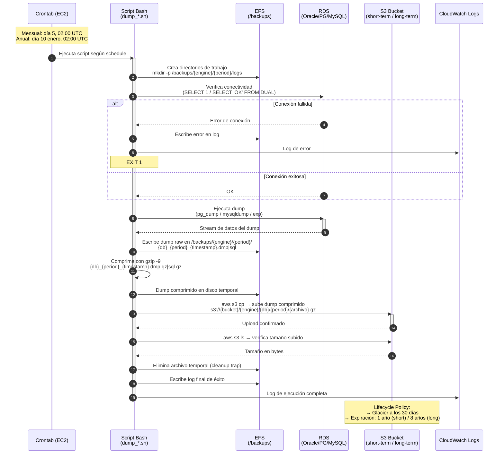

# Diagrama de Secuencia — Proceso de Dumps con EC2

## Descripción paso a paso

| Paso | Componente   | Acción                                                                     |
| ---- | ------------ | -------------------------------------------------------------------------- |
| 1    | Encender EC2 | Encender instancia el día  del Backup                                      |
| 2    | Crontab      | Dispara el script según el schedule configurado (mensual o anual)          |
| 3    | Script       | Crea/verifica directorios de trabajo en EFS (`/backups/{engine}/{period}`) |
| 4    | Script → RDS | Prueba de conectividad (`SELECT 1` o `SELECT 'OK' FROM DUAL`)              |
| 5    | Script → RDS | Ejecuta el dump: `pg_dump`, `mysqldump` o `exp` (Oracle)                   |
| 6    | Script → EFS | Escribe el dump raw en el filesystem temporal (EFS)                        |
| 7    | Script       | Comprime el dump con `gzip -9`                                             |
| 8    | Script → S3  | Sube el archivo comprimido con `aws s3 cp` al bucket correspondiente       |
| 9    | Script → S3  | Verifica el tamaño del archivo subido con `aws s3 ls`                      |
| 10   | Script → EFS | Elimina el archivo temporal (trap cleanup en EXIT)                         |
| 11   | S3           | Lifecycle policy mueve a Glacier a los 30 días y expira según retención    |
| 12   | Apagar EC2   | Apagar EC2                                                                 |
